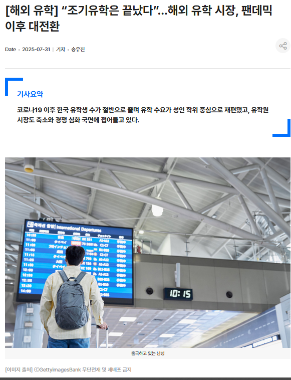
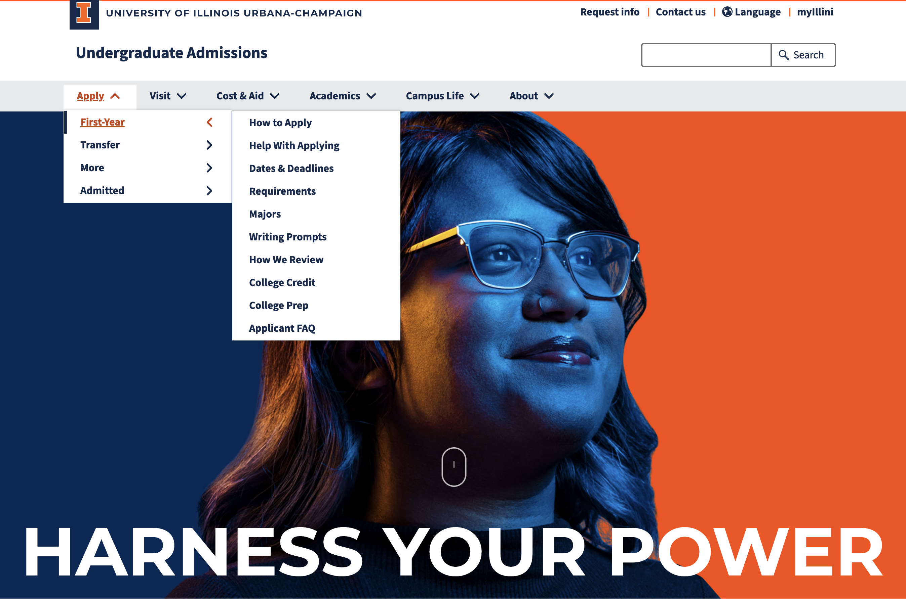
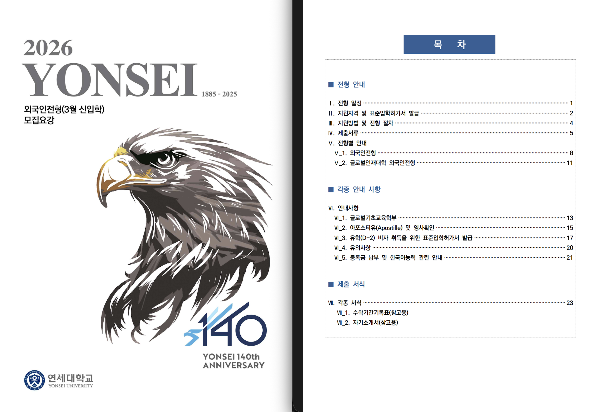
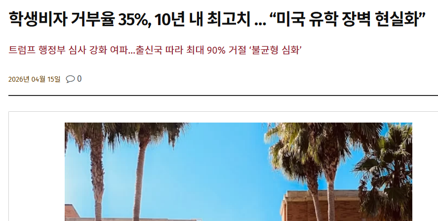
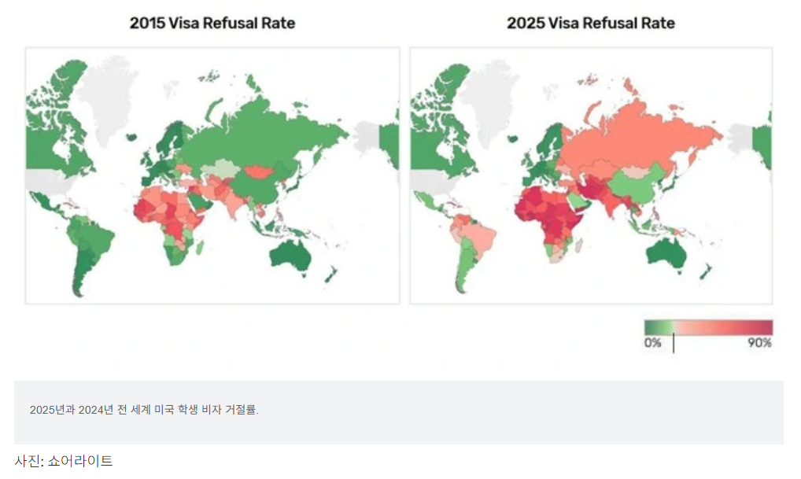
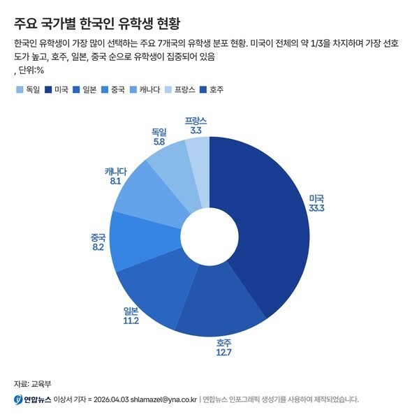
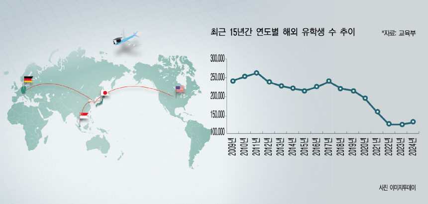
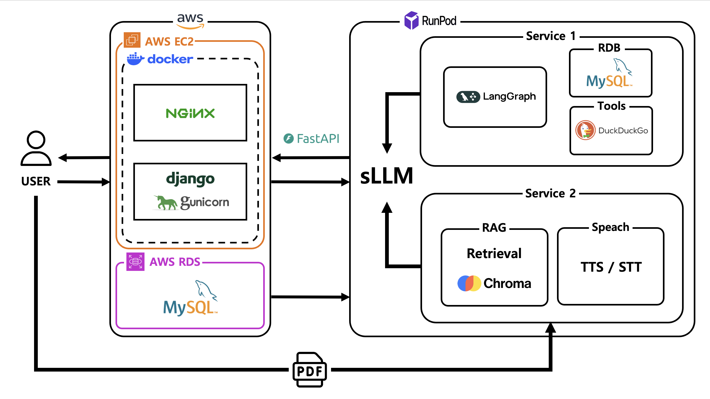
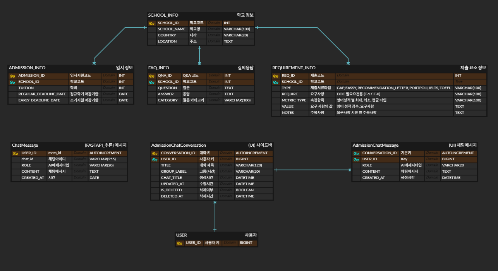

# SKN24-4th-5Team

**대주제**: AI 활용 애플리케이션 개발

**세부 주제**: LLM을 연동한 내외부 문서 기반 질의 응답 웹페이지 개발

**일정**: 2026.04.30 ~ 2026.05.04

##  **1.  팀 소개**

## 팀명 : Waypoint

**유학의 시작부터 출국까지, 가장 확실한 두 가지 관문을 연결하는 안내자** 

-  **Waypoint**는 유학생들이 반드시 거쳐야 하는 두 지점, **입시 정보 탐색**과 **비자 인터뷰 합격**에서 사용자가 길을 잃지 않도록 정확한 가이드를 제공하는 기술적 거점(Waypoint)이 되고자 합니다.

##  팀원 소개

 

| 박정은 | 정재훈 | 조아름 | 권민세 | 
| :---: | :---: | :---: | :---: |
|   |  |  | |
 
 

# **Contents**

1.  [팀 소개](#1--팀-소개)
2.  [프로젝트 개요](#2-프로젝트-개요)
3.  [기술 스택](#3-기술-스택)
4.  [시스템 구성도](#5-시스템-아키텍처)
5.  [WBS](#6-️-wbs)
6.  [요구사항 명세서](#7-요구사항-명세서)
7.  [화면설계서](#7-요구사항-명세서)
8.  [테스트 계획&결과 보고서](#10--테스트-계획-및-결과-보고서)
9.  [수행결과](#12--수행결과)
10.  [진행과정 중 프로그램 개선 노력](#11-서비스모델-성능-개선을-위한-노력)
11.  [한 줄 회고](#13-한-줄-회고)
 

---

##  **2. 프로젝트 개요**

##  **2.1 프로젝트 명 : `Visa La Vista`**
  
>  **“Visa la Vista!”** : 스페인어 '인생이여 만세(Viva La Vida)'에서 착안하여, '성공적인 유학을 통해 펼쳐질 당신의 찬란한 앞날(Vista) 만세!'라는 의미함
`비자 성공부터 글로벌 입시까지 아자아자!! 응원합니다!`

  

##  **2.2 프로젝트 소개**
 **전 세계 대학 입시 정보 챗봇**과 **AI 비자 인터뷰 시뮬레이션** 서비스 제공

- **Viva La Vista**는 유학 준비생들이 마주하는 가장 큰 두 가지 거대 장벽을 허물기 위해 **전 세계 대학 입시 정보 챗봇**과 **AI 모의 비자 인터뷰** 서비스를 제공함

## **2.3 프로젝트 배경 및 필요성**

###  **<h3> 2.3.1. 학위 취득 중심의 유학 시장 개편** </h3>

-   통계청 『유학생 현황』에 따르면, 2010년대 후반 이후 초·중·고교생의 조기 유학 수요가 크게 감소하고, 전체 유학 시장은 **학위 취득 중심의 수요로 재편**되고 있음
-   2023년 기준 해외 유학생의 약 79%가 **정규 학위 취득**을 목적으로 체류 중이며, 이는 단순 경험보다 **확실한 성과**를 원하는 사용자가 늘어났음을 보여줌

	- 👉 **단순 정보 탐색을 넘어 ‘학위 취득과 비자 승인’이라는 구체적 목표를 가진 성인 유학생**을 핵심 타겟으로 설정함

  

  
출처 : <a href="https://edumorning.com/articles/1029">https://edumorning.com/articles/1029</a>  

---
###  **<h3> 2.3.2. 분산된 입시 정보로 인한 탐색의 어려움** </h3>

*   국내 대학(연세대 등)은 '통합자료실'을 통해 모든 입시 정보를 단일 PDF로 제공하는 반면, UIUC를 비롯한 해외 대학은 정보가 여러 웹페이지의 분리 및 500~7000 페이지 분량의 입시요강에 파편화되어 있음
    *   👉 이러한 분산된 구조는 유학원 등 특정 서비스 공급자에게 정보 권력이 독점되는 결과를 초래하며, 학생은 고가의 컨설팅 비용을 지불해야만 하는 구조적 비효율에 직면함
    *   👉 따라서 분산된 입시 데이터를 하나로 통합하고, 복잡한 준비 과정을 일괄적으로 관리해 줄 수 있는 통합 솔루션(챗봇)의 도입이 시급함
|

<table align="center">
  <tr>
    <td>
      
    </td>
    <td>
      
    </td>
  </tr>
</table>

[출처: 연세대학교 공식 홈페이지](https://www.yonsei.ac.kr/), [일리노이 대학교 공식 홈페이지](https://illinois.edu/)

---

###  **<h3> 2.3.3. 학생비자 거부율 35%, 10년 내 최고치,  “미국 유학 장벽 현실화”** </h3>

*   높은 환율, 자국민 우선주의, 취업 불안정성 등 현실적인 리스크가 그 어느 때보다 심화되었지만, **미국**은 여전히 **압도적인 유학생 비중 1위**를 기록하며 견고한 선호도를 보이고 있음
  
    *   👉 **유학 시장의 진입 장벽이 높아짐에 따라 단 한 번의 실수가 없는 철저한 준비가 요구**
    
*   트럼프 행정부 비자 인터뷰 심사 강화 여파로 국제교육업체 쇼어라이트(Shorelight) 분석 결과, 2025년 **F-1(유학생) 비자 거부율은 35%로 집계**됐다. 이는 2024년 31%에서 상승한 수치로, 2015년 이후 10년간 가장 높은 수준인 것을 확인 할 수 있음

	*   👉 **실제 영사와의 인터뷰 환경을 완벽히 재현하여 사용자에게 실질적인 대비책 필요**
   
	  

<table align="center">
  <tr>
    <td>
      
    </td>
    <td>
      
    </td>
  </tr>
</table>

  
출처 : <a href="https://knewsla.com/usa/20260415110110/">https://knewsla.com/usa/20260415110110/</a>  

  
출처 : <a href="https://www.vietnam.vn/ko/ty-le-truot-visa-du-hoc-my-cao-nhat-10-nam">https://www.vietnam.vn/ko/ty-le-truot-visa-du-hoc-my-cao-nhat-10-nam</a>  

---

###  **<h3> 2.3.4. 실용적 유학 트렌드와 대안 탐색 확대** </h3>

*   미국 외 대안 국가의 대학교를 찾는 수요가 늘고 있음
  
    *   👉 **특정 국가나 학교에 편중된 유학원의 영업성 정보가 아닌, 전 세계 대학 데이터를 아우르는 객관적인 플랫폼이 필요함**
    

<table align="center">
  <tr>
    <td>
      
    </td>
    <td>
      
    </td>
  </tr>
</table>

  출처: <a href="https://www.naeil.com/news/read/556332?ref=naver">https://www.naeil.com/news/read/556332?ref=naver</a>

  출처: <a href="https://www.topdigital.com.au/news/articleView.html?idxno=30560">https://www.topdigital.com.au/news/articleView.html?idxno=30560</a>

---

##  **2.4 프로젝트 목표**

### **[1] Broad Perspective: 넓은 시야**

> **목표:** LLM Tool과 SQL Agent 기술로 내부 데이터의 한계를 넘어 전 세계 입시 정보를 통합함

-   **FastAPI 기반 입시 정보 통합 검색 챗봇**: 주요 대학의 정밀 DB(SQL Agent)와 실시간 외부 탐색 툴(LLM Tool)을 결합하여, 사용자의 조건에 맞는 전 세계 대안 대학 정보를 즉각 제공함
  
    -   **[한계 극복]** 
	    - 고정된 내부 DB의 정보 부족 한계를 **LLM Tool**을 통한 실시간 외부 정보 탐색으로 확장함,
	    - **FastAPI**와 **SQL Agent**로 구조화하여 유학원마다 파편화된 정보를 한눈에 조망할 수 있는 넓은 시야를 제공함
        
### **[2] Clear Vision: 명확한 전망**

> **목표:** STT/TTS와 RAG 기술로 실제 인터뷰 환경을 구현하고 합격 가능성을 데이터로 가시화함

-   **멀티모달 AI 비자 시뮬레이션**: **STT/TTS** 기반의 '실전/연습 모드'를 통해 35%의 비자 거절 불확실성을 정면 돌파함
  
    -   **[한계 극복]** 
	    - 주관적 판단에 의존하던 기존 방식을 RAG 기반 정보 일치성 검토, 언어 문법 및 음성 분석(속도·유창성 등)의 다각도 평가를 수행함
	    - 단순 조언을 넘어 합격/불합격 여부, 개선점, 문항별 추천 답변이 포함된 최종 분석 리포트를 제공함으로써 준비 과정의 가시성을 확보하고 명확한 합격 결과를 설계함
        
        
### **[3] 통합 플랫폼 (Integrated Platform): 입시 챗봇과 비자 모의 인터뷰 서비스를 하나로 잇는 유학 솔루션**

>**목표**: Django와 AWS RDS 인프라를 활용하여, 입시 정보 챗봇과 비자 인터뷰 시뮬레이션을 한 플랫폼 내에 통합 구축함

-   **독립적 핵심 기능의 플랫폼화**:
	- 입시 정보 챗봇: 파편화된 전 세계 대학 데이터를 체계적으로 구조화하여, 방대한 모집요강을 즉각적으로 탐색할 수 있는 전문 챗봇 환경 구축
	- 비자 인터뷰 시뮬레이션: 실제 영사와의 인터뷰 환경을 재현하여 실전 대응력을 높이는 독립적인 AI 트레이닝 모듈 구현
    
    -   **[한계 극복]** 
		- 서비스 간 경계 제거: 입시와 비자로 파편화된 유학 준비 과정을 단일 플랫폼에 집약하여, 정보 탐색의 비효율과 실전 대비의 막연함을 동시에 해결함
    	- 고비용 구조 개선 : 특정 유학원에 종속된 고비용·폐쇄적 정보 구조를 탈피하고, 누구나 고도화된 기술 서비스를 저비용으로 누릴 수 있는 유학 준비의 대중화를 실현함

## 3. 기술 스택

| 분류 | 기술 및 도구 |
| :---: | :--- |
| **Frontend** |     |
| **Backend** |   |
| **AI & LLM** |       |
| **Infrastructure** |    |
| **Database** |    |
| **Development** |    |
| **Collaboration** |     |

---

##  4. 모델 선정
### STT / TTS 모델 선택 근거

### - STT (Speech-to-Text)

| 항목 | Whisper | Google STT | Azure STT | DeepSpeech | **Vosk ✓** | Wav2Vec2 |
|------|:-------:|:----------:|:---------:|:----------:|:----------:|:--------:|
| 오프라인 동작 | ✅ | ❌ | ❌ | ✅ | ✅ | ✅ |
| 실시간 스트리밍 | ❌ | ✅ | ✅ | ❌ | ✅ | ❌ |
| 무료/오픈소스 | ✅ | ❌ | ❌ | ✅ | ✅ | ✅ |
| 경량 (저사양) | ❌ | ✅ | ✅ | ❌ | ✅ | ❌ |
| Python 연동 | ✅ | ✅ | ✅ | ✅ | ✅ | ✅ |
| API 비용 | 없음 | 유료 | 유료 | 없음 | **없음** | 없음 |

- **Vosk 선택 이유**: 오프라인 + 실시간 스트리밍을 동시에 지원하는 유일한 무료 모델.
- Whisper는 스트리밍 불가, Google/Azure는 유료라 제외.

---

### - TTS (Text-to-Speech)

| 항목 | Piper | Google TTS | Azure TTS | Coqui TTS | **gTTS ✓** | ElevenLabs |
|------|:-----:|:----------:|:---------:|:---------:|:----------:|:----------:|
| 오프라인 동작 | ✅ | ❌ | ❌ | ✅ | ❌ | ❌ |
| 무료/오픈소스 | ✅ | ❌ | ❌ | ✅ | ✅ | ❌ |
| 설치 난이도 | 중간 | 쉬움 | 중간 | 어려움 | **쉬움** | 쉬움 |
| 음성 자연스러움 | 높음 | 높음 | 매우높음 | 높음 | 보통 | 매우높음 |
| Python 연동 | ✅ | ✅ | ✅ | ✅ | ✅ | ✅ |
| API 비용 | 없음 | 유료 | 유료 | 없음 | **없음** | 유료 |

- **gTTS 선택 이유**: pip 한 줄 설치, 다른 모델에 비해 속도가 가장 빠름, API 비용 없음, 자연스러움 영어 발음 (면접관 TTS 출력용)
- 면접 연습 특성상 음질보다 빠른 응답이 우선이라 고품질 유료 모델은 제외.

##  5. 🧩시스템 아키텍처

## 5.1. ERD

### 🔹 ChatMessage (FastAPI 추론용)

* DB에 저장되지 않는 임시 메시지 구조
* FastAPI에서 Claude API로 전달되어 응답 생성을 위한 컨텍스트로 사용됨

### 🔹 AdmissionChatConversation + AdmissionChatMessage (Django RDS 저장용)

* 실제 RDB(MySQL 등)에 저장되는 대화 데이터
* 대화 기록 관리 및 채팅 UI(목록/말풍선) 렌더링에 사용됨

##  6. 🖼️ WBS

  

##  7. 📝요구사항 명세서

  
##  8. 📻 테스트 계획 및 결과 보고서

## 테스트 시나리오 보고서

### 결과 요약

| 총 시나리오 | Pass | Fail | 미실시 |
|:-----------:|:----:|:----:|:------:|
| 3 | 3 | 0 | 0 |

---

### TEST-001 · 입시챗봇 — DB 답변 및 웹 검색 전환

- **목적** : DB 등록 학교 질문 시 입시 정보+링크 제공, 미등록 학교 질문 시 웹 검색으로 전환하여 공식 링크를 안내하는지 확인  
- **결과** : ✅ PASS
	- DB에 저장된 미국 대학교 정보 추출 확인 / DB 미존재 대학교 웹 검색 전환 확인

| No | 테스트 절차 | 기대 결과 | 결과 |
|----|------------|----------|:----:|
| 1 | 'A대학교 입학 요건을 알려줘' 입력 후 전송 | DB 기반 입시 정보 및 공식 URL 링크 포함 답변 출력 | ✅ |
| 2 | 답변 내 URL 링크 클릭 가능 여부 확인 | 클릭 가능한 하이퍼링크 1개 이상 포함 | ✅ |
| 3 | 'Z대학교 입학 요건을 알려줘' 입력 후 전송 | 웹 검색 실행 후 공식 사이트 링크 안내 | ✅ |
| 4 | 아무것도 입력하지 않고 전송 버튼 클릭 | 전송 버튼 비활성화 또는 입력 요청 | ✅ |
| 5 | 두 번째 질문 전송 후 첫 번째 답변 화면 확인 | 이전 메시지 유지, 채팅 형식으로 누적 표시 | ✅ |

---

### TEST-002 · 비자 인터뷰 — 연습 모드 전체 흐름

- **목적** : PDF 업로드 → 질문 수 설정 → 인터뷰 진행 → 답변 누적 → 평가 출력 → PDF 다운로드 전체 플로우 확인  
- **결과** : ✅ PASS
	- 질문 개수 선택부터 최종 피드백까지 전체 플로우 완벽 수행 확인

| No | 테스트 절차 | 기대 결과 | 결과 |
|----|------------|----------|:----:|
| 1 | '연습 모드' 클릭 | 연습 모드 강조 표시 및 질문 수 설정 화면 노출 | ✅ |
| 2 | 질문 개수 3개로 설정 | 선택 값(3) 적용 확인 | ✅ |
| 3 | 테스트용 I-20 PDF 업로드 | 텍스트 추출 완료 메시지 및 시작 버튼 활성화 | ✅ |
| 4 | 시작 버튼 클릭 | 첫 번째 질문 텍스트 표시 및 TTS 음성 출력 | ✅ |
| 5 | 마이크 활성화 후 영어로 답변 녹음 및 종료 | STT 변환 후 사용자 답변 말풍선 표시, 다음 질문 자동 생성 | ✅ |
| 6 | 2~3번째 질문 동일하게 답변 진행 | 질문·답변 말풍선 누적 표시 | ✅ |
| 7 | 마지막 답변 완료 후 평가 화면 확인 | 종합 피드백 출력 (최종 결과·전반 피드백·개선사항 포함) | ✅ |
| 8 | 'PDF 다운로드' 버튼 클릭 | 피드백 PDF 파일 생성 및 다운로드 | ✅ |

---

### TEST-003 · 비자 인터뷰 — 실전 모드 제약사항 검증

- **목적** : 텍스트 미표시, 자동 마이크 활성화, 타이머 종료 처리, 다시 듣기 제한, 페이지 이탈 시 음성 중지 동작 확인  
- **결과** : :white_check_mark: PASS
	- 실전 모드 제약사항 전체 정상 동작, 피드백 PDF 다운로드 완료

| No | 테스트 절차 | 기대 결과 | 결과 |
|----|------------|----------|:----:|
| 1 | 실전 모드 선택 → PDF 업로드 → 시작 클릭 | 타이머 시작, 질문 음성 자동 재생, 사운드 웨이브 말풍선 표시 | :white_check_mark: |
| 2 | 음성 재생 중 '다시 듣기' 버튼 존재 여부 확인 | 다시 듣기 버튼 미표시 | :white_check_mark: |
| 3 | 질문 음성 재생 완료까지 대기 | 질문 말풍선 웨이브 정지 | :white_check_mark: |
| 4 | 음성 종료 후 5초 카운트다운 대기 | 5초 후 마이크 자동 활성화, 입력 필드 웨이브 동작 | :white_check_mark: |
| 5 | 답변 녹음 후 종료 | 사용자 말풍선에 멈춘 웨이브 표시 | :white_check_mark: |
| 6 | 음성 재생 중 다른 페이지로 이동 | 음성 재생 및 녹음 즉시 중지 | :white_check_mark: |
| 7 | 재진입 후 제한 시간까지 인터뷰 진행 | 타이머 종료 시 피드백 단계 자동 전환 | :white_check_mark: |
| 8 | 피드백 출력 후 추가 답변 입력 시도 | 추가 말풍선·질문·피드백 생성 없음 | :white_check_mark: |
| 9 | 'PDF 다운로드' 버튼 클릭 | 실전 모드 피드백 PDF 생성 및 다운로드 | :white_check_mark: |

---

##  9. 서비스모델 성능 개선을 위한 노력

  

### ☑️ 주요 개선 사항 1 : LangGraph 기반 글로벌 검색 에이전트 구축
- [Challenge] 기존 시스템의 한계: 정적 데이터 기반의 정보 국한성
기존의 SQL 기반 시스템은 내부 DB에 저장된 과거 데이터에만 의존하여, 실시간으로 변하는 전 세계 대학의 입시 요강이나 글로벌 합격 사례를 반영하지 못하는 한계가 있음

- **[Solution] DuckDuckGo 검색 노드 통합을 통한 글로벌 지식 확장
이러한 한계를 극복하기 위해 LangGraph 워크플로우 내에 search_node를 추가하여 지식 탐색의 범위를 전 세계로 확장함**

	1. 실시간 글로벌 탐색 : 내부 데이터베이스의 시의성 한계를 극복하기 위해, DuckDuckGo 검색 엔진을 노드로 통합하여 전 세계 대학의 최신 입시 요강과 실시간 합격 데이터를 즉각적으로 수집 및 반영하도록 구축함
	2. 하이브리드 지식 아키텍처 : 내부의 정밀한 통계 데이터(SQL)와 외부의 동적인 웹 정보(Search)를 유연하게 결합하는 멀티 에이전트 워크플로우를 완성하여, 정보의 깊이와 넓이를 동시에 확보함
	3. 데이터 검증 및 환각 방지 : LLM이 추론 과정에서 불확실한 정보를 생성할 경우, 외부 검색 데이터를 통한 교차 검증(Cross-check) 로직을 실행하여 답변의 정확성과 신뢰도를 극대화함

### ☑️ 주요 개선 사항 2 : 비자 모의 인터뷰 서비스 연습모드 & 실전모드 분리

- [Challenge] 기존 시스템의 한계: 단일 인터뷰 흐름으로 인한 사용자 니즈 반영 부족
기존 비자 인터뷰 챗봇은 하나의 인터뷰 흐름만 제공하여, 사용자가 반복적으로 연습하고 싶은 상황과 실제 인터뷰처럼 긴장감 있게 진행하고 싶은 상황을 구분하기 어렵다는 한계가 있으므로, 이에 따라 학습 목적과 실전 대비 목적을 모두 만족시키기 위한 모드 분리가 필요함

- **[Solution] 연습모드와 실전모드 기반 인터뷰 흐름 설계
이를 개선하기 위해 비자 인터뷰 서비스를 연습모드와 실전모드로 분리하고, 각 모드의 목적에 맞는 인터뷰 진행 방식을 적용함**

	1. 연습모드 제공 : 사용자가 원하는 질문 수를 선택하여 반복적으로 답변을 연습할 수 있도록 구성했습니다. 또한 생성된 질문을 다시 들을 수 있도록 하여, 질문 이해와 답변 준비를 충분히 할 수 있는 학습 중심의 흐름을 제공했습니다.
	2. 실전모드 제공 : 실제 비자 인터뷰가 짧은 시간 안에 진행되는 점을 고려하여 제한 시간 기반의 인터뷰 흐름을 적용했습니다. 질문은 한 번만 제공되고, 사용자는 일정 대기 시간 이후 바로 답변하도록 구성하여 실제 인터뷰와 유사한 환경을 구현했습니다.
	3. 사용자 맞춤형 인터뷰 경험 강화 : 반복 학습이 필요한 사용자와 실전 감각을 익히고 싶은 사용자가 각자의 목적에 맞는 방식으로 서비스를 이용할 수 있도록 개선했습니다. 이를 통해 비자 인터뷰 준비 과정의 실용성과 몰입도를 높였습니다.

### ☑️ 주요 개선 사항 3 : 비자 인터뷰 평가 지표 고도화

- [Challenge] 기존 시스템의 한계: LLM 정성 평가에 의존한 합격/불합격 판단
기존 비자 인터뷰 챗봇은 사용자의 답변을 바탕으로 LLM이 합격/불합격을 판단했지만, 명확한 평가 지표 없이 정성적 판단에 의존하는 한계가 있었음

- **[Solution] 정성적 평가와 정량적 평가를 결합한 평가 구조 도입
이를 개선하기 위해 답변 내용에 대한 정성적 평가와 음성 및 문법 기반의 정량적 평가를 함께 반영하는 구조로 개선함**

	1. 정성적 답변 평가 : 답변의 논리성과 사용자 정보와의 일관성을 평가하여, 비자 인터뷰 질문에 적절하고 신뢰성 있는 답변을 제공했는지 판단하도록 구성함
	2. 음성 기반 언어 구사 평가 : 사용자의 음성 답변에서 속도, 리듬, 유창성 등을 분석하여 실제 인터뷰 상황에서의 말하기 능력을 평가할 수 있도록 개선함
	3. 문법 오류 기반 언어 평가 : 사용자의 답변 텍스트를 기반으로 문법 오류를 분석하여 영어 답변의 정확성을 평가 지표에 반영함
	4. 평가 결과 신뢰도 향상 : 정성적 판단과 정량적 지표를 함께 활용함으로써 합격/불합격 판단의 객관성을 높이고, 사용자에게 보다 구체적인 개선 방향을 제공할 수 있도록 구현함

### ☑️ 주요 개선 사항 4 : 입시와 비자를 관통하는 통합 유학 솔루션 구축
- [Challenge] 기존 시스템의 한계: 입시와 비자로 파편화된 유학 준비 과정
유학 준비생들은 대학 입학 정보 탐색과 비자 인터뷰 준비를 서로 다른 플랫폼에서 각기 진행해야 했으며, 이 과정에서 발생하는 정보의 파편화와 비용적 부담이 크다는 한계가 있음

- [Solution] 유학 준비의 End-to-End 통합 플랫폼 구현
파편화된 과정을 하나의 파이프라인으로 연결하여, 정보 탐색부터 실전 대비까지 단일 플랫폼 내에서 해결하도록 아키텍처를 설계함
	
	1. 서비스 간 경계 제거 (Unified Pipeline) : Django와 AWS RDS 인프라를 기반으로 '입시 정보 챗봇'과 '비자 모의 인터뷰'를 통합하여, 대학 탐색 후 즉시 비자 준비로 이어지는 심리스(Seamless)한 사용자 경험을 제공함
	2. 고비용 구조의 기술적 해결 : 특정 기관에 종속된 폐쇄적이고 고비용인 유학 정보 시장의 한계를 기술로 극복했습니다. STT, LLM, RAG 등 고도화된 AI 기술을 통해 누구나 저비용으로 고품질의 컨설팅 서비스를 누릴 수 있는 환경을 실현함
	3. 데이터 기반 실전 대응력 강화 : 전 세계 대학의 방대한 모집 요강을 구조화하고 실제 영사와의 인터뷰 환경을 재현한 모듈을 구축하여, 유학 준비의 막연함을 실질적인 실전 대응력으로 전환함
 
##  10. 💻 수행결과

-  서비스 영상 추가

  

##  11. 한 줄 회고

  

|  **이름**  |  **회고 내용**  |

|  --------  |  -------------  |

| 권민세 |

| 박정은 | |

| 정재훈 |  |

| 조아름 | 
